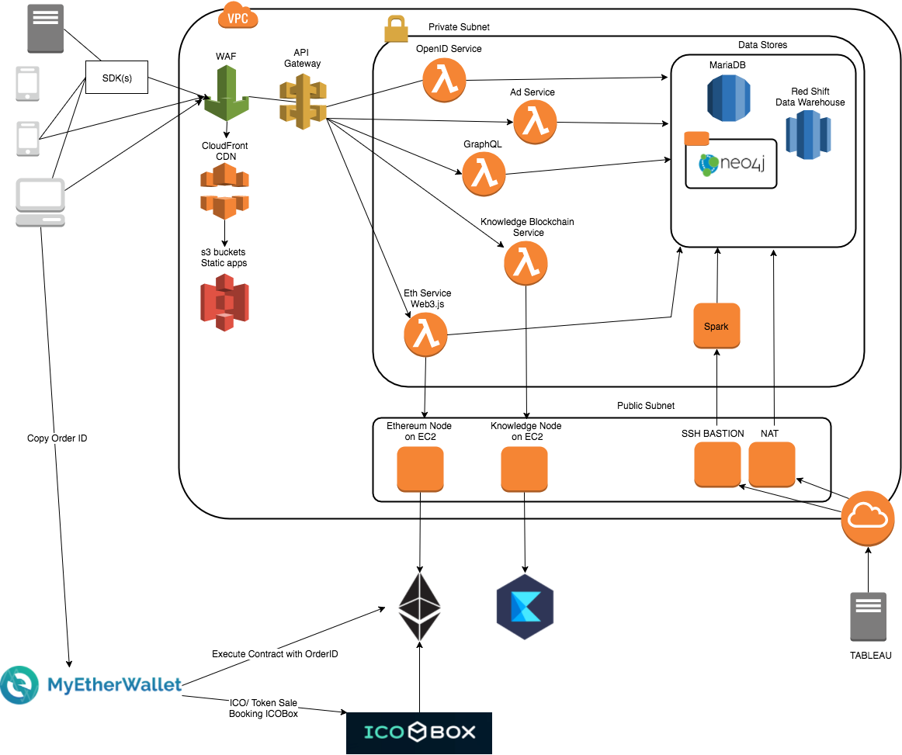

# Knowledge Infrastructure

[](https://git.io/col)


Cloud Formation files for Knowledge Infrastructure

<!-- START doctoc generated TOC please keep comment here to allow auto update -->
<!-- DON'T EDIT THIS SECTION, INSTEAD RE-RUN doctoc TO UPDATE -->
## Contents

- [Features](#features)
- [Architecture](#architecture)
- [Getting Started](#getting-started)
    - [Infrastructure-as-Code](#infrastructure-as-code)
    - [Self-documenting](#self-documenting)
    - [Intelligent updating & rollback](#intelligent-updating--rollback)
- [Folder Structure](#folder-structure)
- [Template Details](#template-details)
- [Naming Conventions](#naming-conventions)
- [Best Practices to Follow](#best-practices-to-follow)
- [Development Environment Dependencies](#development-environment-dependencies)
- [Tasks manager](#tasks-manager)
- [AWS Accounts](#aws-accounts)
- [Security and monitoring](#security-and-monitoring)
- [Contributing](#contributing)
- [Bug Reporting](#bug-reporting)
- [About Knowledge](#about-knowledge)

<!-- END doctoc generated TOC please keep comment here to allow auto update -->

## Features

TODO: write this feature list

- item 1
- item 2
- item 3

## Architecture

TODO: update these diagrams. Have proper network docs.   
[knowledge-infrastructure/issues/24](https://github.com/knowledge/knowledge-infrastructure/issues/24)


## Getting Started

Using CloudFormation to deploy and manage infrastructure, environments and services has a number of nice benefits over more traditional methods (AWS CLI, scripting, etc.).

#### Infrastructure-as-Code

A template can be used repeatedly to create identical copies of the same stack (or to use as a foundation to start a new stack). Templates are simple YAML-formatted text files that can be placed under your normal source control mechanisms. With CloudFormation, you can see exactly which AWS resources make up a stack. You retain full control and have the ability to modify any of the AWS resources created as part of a stack.

#### Self-documenting

Fed up with outdated documentation on your infrastructure or environments? Still keep manual documentation of IP ranges, security group rules, etc.?

With CloudFormation, your template becomes your documentation. Want to see exactly what you have deployed? Just look at your template. If you keep it in source control, then you can also look back at exactly which changes were made and by whom.

#### Intelligent updating & rollback

CloudFormation not only handles the initial deployment of your infrastructure and environments, but it can also manage the whole lifecycle, including future updates. During updates, you have fine-grained control and visibility over how changes are applied, using functionality such as [change sets](https://aws.amazon.com/blogs/aws/new-change-sets-for-aws-cloudformation/), [rolling update policies](http://docs.aws.amazon.com/AWSCloudFormation/latest/UserGuide/aws-attribute-updatepolicy.html) and [stack policies](http://docs.aws.amazon.com/AWSCloudFormation/latest/UserGuide/protect-stack-resources.html).

## Folder Structure
```
.
├── images                  # Diagrams and images go here
├── infrastructure          # Infrastructure templates
├── services                # Service templates grouped by service name folder
    ├── service-one
    └── service-two
├── tests                   # Scripts for validating and testing the templates
├── CONTRIBUTING.md         # Colaboration guidelines
└── README.md
```

## Template Details

The templates below are included in this repository and reference architecture:

| Template | Description |
| --- | --- |
| [infrastructure/vpc.yml](infrastructure/vpc.yml) | ... |
| [infrastructure/vpc-bastion-instance.yml](infrastructure/vpc-bastion-instance.yml) | ... |
| [infrastructure/vpc-nat-instance.yml](infrastructure/vpc-nat-instance.yml) | ... |
| [infrastructure/cluster.yml](infrastructure/cluster.yml) | ... |

## Naming Conventions

- Always use lowercase letters and hypens for stack names, tags, outputs.
- Use CamelCase for resources inside the templates.
- For outputs and stack names always follow this convention  
  `${Environment}-${Service}-${resource}`   
  Eg.
  `dev-vpc-subnet-private-d`, `prod-marketplace-load-balancer`, `dev-vpc`, `dev-vpc-nat-gateway`, `prod-marketplace-database`
- Environment names are short `prod`, `stg`, `dev`, `play`, `bob`, `sam`, ...

## Best Practices to Follow

- Never output sensitive data.
- Never store sensitive data in this repo ( secrets, passwords ).
- Prefer AWS CLI over AWS CF GUI.
- Enable termination protection for mission critical stacks.
- Ensure CloudFormation stack policies are set to prevent accidental updates to stack resources.
- Ensure that the IAM role associated with your AWS CloudFormation stack grants least privilege.
- Enable AWS CloudFormation Stack Notifications.  SNS.
- Setup AWS Config.

## Development Environment Dependencies

You need some global environment configurations

- install [AWS CLI](https://aws.amazon.com/cli/) `pip install awscli`
- install [Node.js](https://github.com/nodejs/node) v8.9.3. We recommend using [nvm and avn to manage the node versions](https://gaboesquivel.com/blog/2015/automatic-node.js-version-switching/).

## Tasks manager

We use [NPM](https://www.npmjs.com/) as our task manager. It comes as part Node.js you install globally.
Run the following on the root folder to install the project dependencies.  `npm install`

We currently have 2 tasks:

- `npm run test`   this will execute `test/validate-templates.sh`
- `npm run doctoc` this will update the table of contents in the README.

## AWS Accounts

We have an AWS organization with multiple accounts.

- `master account` owns the organization and have access to consolidated billing.
- `playground account` is dedicated to experimentation and everyone has admin rights here.
- `development account` holds the `dev` and `stg` VPCs, and other feature environments.
- `production account` highly secured, holds a zero trust `prod` VPC.
- `monitoring account` is used event log aggregation. Engineering have restricted access for debugging.

**AWS Console Login Routes**

- [knowledge-playground](https://knowledge-playground.signin.aws.amazon.com/)
- [knowledge-development](https://knowledge-development.signin.aws.amazon.com/)
- [knowledge-monitoring](https://knowledge-monitoring.signin.aws.amazon.com/)


## Security and monitoring

TODO: complete/enhance this sections

- Enable 2FA on all services
- We recommend using a [1password](https://1password.com/) to manage your passwords.
- We use [Evident.io](https://evident.io/) as our monitoring service.

## Contributing

Read the [contributing guidelines](CONTRIBUTING.md) for details.

## Bug Reporting

Please report bugs big and small by [opening an issue](https://github.com/knowledge/knowledge-insfrastructure/issues/new). No possible bug report is too small.

---
## About Knowledge

Blockchain technology is rebuilding the internet in a trustless, decentralized way, allowing for fundamental core improvements on existing business models and industries, and a new breed of dot-io powerhouse frameworks are emerging. Knowledge.io is producing an ecosystem that offers significant improvement in the areas of ad tech, commerce, education, and employment, and a supply and demand marketplace of goods and services, all based around rewarding users for what the massive and centralized supergiants utilize to make extraordinary profits - people’s data. The Knowledge.io ecosystem is built on the foundation of decentralization and rewarding people for sharing their knowledge.

[knowledge.io](https://knowledge.io)  

<!-- Please don't remove this: Grab your social icons from https://github.com/carlsednaoui/gitsocial -->

<!-- display the social media buttons in your README -->

[![Knowledge Twitter][1.1]][1]
[![Knowledge Facebook][2.1]][2]
[![Knowledge Github][3.1]][3]

<!-- links to social media icons -->
<!-- no need to change these -->

<!-- icons with padding -->

[1.1]: http://i.imgur.com/tXSoThF.png (twitter icon with padding)
[2.1]: http://i.imgur.com/P3YfQoD.png (facebook icon with padding)
[3.1]: http://i.imgur.com/0o48UoR.png (github icon with padding)

<!-- icons without padding -->

[1.2]: http://i.imgur.com/wWzX9uB.png (twitter icon without padding)
[2.2]: http://i.imgur.com/fep1WsG.png (facebook icon without padding)
[3.2]: http://i.imgur.com/9I6NRUm.png (github icon without padding)


<!-- links to your social media accounts -->
<!-- update these accordingly -->

[1]: http://www.twitter.com/KnowledgeToken
[2]: http://www.facebook.com/KnowledgeToken
[3]: http://www.github.com/knowledge

<!-- Please don't remove this: Grab your social icons from https://github.com/carlsednaoui/gitsocial -->
